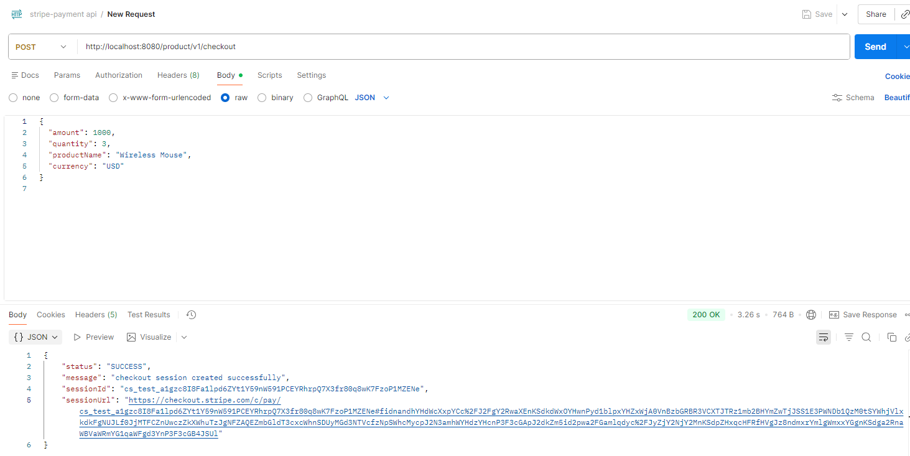
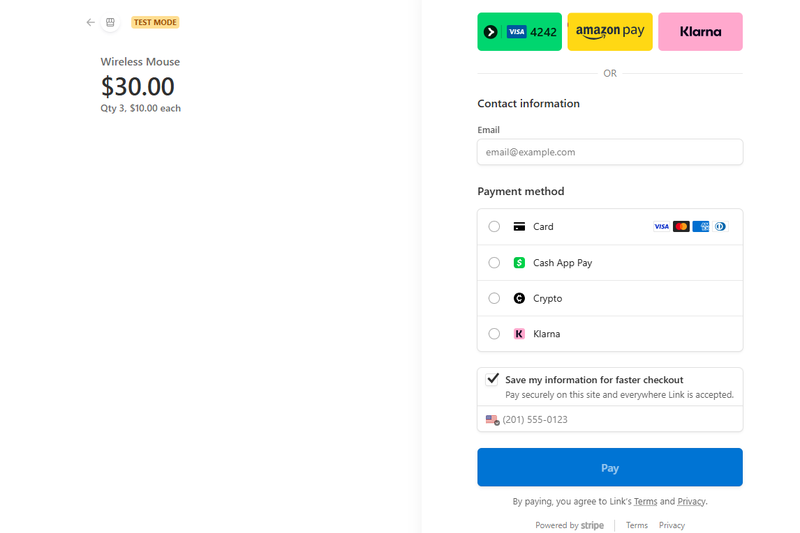

## Overview
Simple Java Spring Boot e-commerce demo integrating Stripe Checkout. Backend endpoint used by the frontend `src/main/resources/templates/index.html` to create Stripe Checkout sessions.

## Tech stack
- Java (LTS)
- Spring Boot
- Maven
- Stripe Java SDK
- thymeleaf templating
- Plain HTML frontend (Bootstrap + Stripe.js)

## Prerequisites
- JDK 17\+ installed
- Maven installed
- Stripe account (publishable & secret keys)

## Configuration
Set your Stripe secret key in Spring configuration (example `src/main/resources/application.properties`):

    stripe.secretKey=sk_test_...

Do not commit secret keys to source control.

Also update the publishable key in `src/main/resources/templates/index.html` (replace `PROVIDE YOUR KEY`).

## Build & Run
From project root:

    mvn clean package
    mvn spring-boot:run

Or run the produced jar:

    java -jar target/<artifact>-<version>.jar

## API
POST `/product/v1/checkout`  
Request JSON (example):

    {
        name: "Smartphone",
        amount: 15000,     # amount in cents (smallest currency unit)
        quantity: 1,
        currency: "usd"    # optional, defaults to usd
    }

Response JSON contains `status`, `message`, and on success `sessionId` and `sessionUrl`. Frontend uses `sessionId` to call Stripe Checkout.

## Sample cURL
(Adjust host/port and JSON keys)

    curl -X POST http://localhost:8080/product/v1/checkout \
      -H "Content-Type: application/json" \
      -d '{"name":"Smartphone","amount":15000,"quantity":1}'

## Logging & debugging
- Check application logs for stack traces and Stripe exception messages.
- Use Stripe dashboard logs (request-id) to correlate failed API calls.

## API Request / Response Example

## What the Demo Showcases
- Hosted Stripe Checkout Page with dynamic product details
- Test Mode environment for safe development and validation
- Multiple payment methods, including:
    - Card payments \(Visa, Mastercard, AmEx, Discover\)
    - Amazon Pay
    - Cash App Pay
    - Crypto
    - Klarna \(Pay Later options\)
- Prefilled customer contact fields to simulate real\-world checkout flows
- Link integration for faster repeat checkouts
- Secure \“Pay\” action powered entirely by Stripe’s backend

## License
MIT
